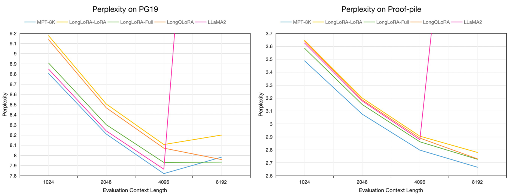
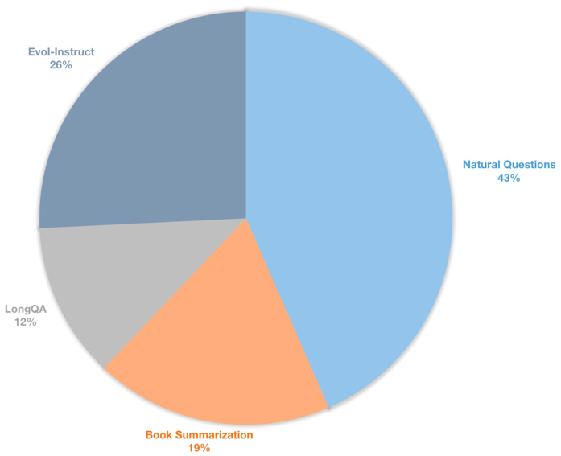
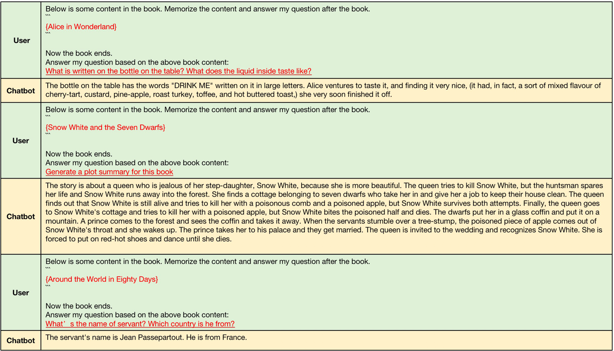

# LongQLoRA: Efficient and Effective Method to Extend Context Length of LLM

[//]: # (## Technical Report)

[//]: # (Technical Report: [LongQLoRA: Efficient and Effective Method to Extend Context Length of Large Language Models]&#40;&#41;)

## Introduction
LongQLoRA is a memory-efficient and effective method to extend context length of Large Language Models with less training GPUs. 
**On a single 32GB V100 GPU**, LongQLoRA can extend the context length of LLaMA2 7B and 13B from 4096 to 8192 and even to 12k.
LongQLoRA achieves competitive perplexity performance on PG19 and Proof-pile dataset after only 1000 finetuning steps, our model outperforms LongLoRA and is very close to MPT-7B-8K.
LongQLoRA combines the advantages of Position Interpolation, QLoRA and Shift Short Attention.


 Evaluation perplexity on PG19 validation and Proof-pile test datasets in evaluation context length of 8192:

| Model               | PG19     | Proof-pile |
|---------------------|----------|------------|
| LLaMA2-7B           | \>1000   | \>1000     |
| MPT-7B-8K           | 7.98     | 2.67       |
| LongLoRA-LoRA-7B-8K | 8.20     | 2.78       |
| LongLoRA-Full-7B-8K | 7.93     | 2.73       |
| **LongQLoRA-7B-8K** | **7.96** | **2.73**   |

Evaluation perplexity of 7B models on PG19 validation and Proof-pile test datasets in evaluation context
length from 1024 to 8192:



## Dataset
We sample about 54k long text from Redpajama dataset to finetune pretrained models, whose token lengths ranging from 4096 to 32768.

We also build a long context instruction dataset for supervised finetuning chat models. This dataset contains
39k instruction data, mainly including book summarization, Natural Questions, subset of LongQA and Evol-Instruct of WizardLM.
In order to adapt to the target length of 8192, the max token number of each data is 8192. The distribution is as follows.




| Dataset                                                                                     | Description                                             |
|---------------------------------------------------------------------------------------------|---------------------------------------------------------|
| 🤗[LongQLoRA-Pretrain-Data-54k](https://huggingface.co/datasets/YeungNLP/LongQLoRA-Dataset) | Include 54212 data, used to finetune pretrained model   |
| 🤗[LongQLoRA-SFT-Data-39k](https://huggingface.co/datasets/YeungNLP/LongQLoRA-Dataset)      | Include 38821 data, used to finetune chat model         |

## Model

| Model                                                                                         | Context Length  | Description                                                                   |
|-----------------------------------------------------------------------------------------------|-----------------|-------------------------------------------------------------------------------|
| 🤗[LongQLoRA-Llama2-7b-8k](https://huggingface.co/YeungNLP/LongQLoRA-Llama2-7b-8k)            | 8192            | Finetuned with LongQLoRA-Pretrain-Data-54k for 1k steps based on LLaMA2-7B    |
| 🤗[LongQLoRA-Vicuna-13b-8k](https://huggingface.co/YeungNLP/LongQLoRA-Vicuna-13b-8k)          | 8192            | Finetuned with LongQLoRA-SFT-Data-39k for 1.7k steps based on Vicuna-13B-V1.5 |
| 🤗[LongQLoRA-Llama2-7b-8k-lora](https://huggingface.co/YeungNLP/LongQLoRA-Llama2-7b-8k-lora)  | 8192            | LoRA weights                                                                  |
| 🤗[LongQLoRA-Vicuna-13b-8k-lora](https://huggingface.co/YeungNLP/LongQLoRA-Vicuna-13b-8k)     | 8192            | LoRA weights                                                                  |

## Training
The training configs are saved in the train_args directory, some parameters are as follows:
- `sft`: Do sft task if set as True, otherwise do pretraining task.
- `model_max_length`: The target context length.
- `max_seq_length`: The max sequence length in training, should be less than or equal to model_max_length
- `logging_steps`: Log training loss every n steps.
- `save_steps`: Save model every n steps.
- `lora_rank`: The LoRA rank in training.

Extend context length of pretrained model LLaMA2-7B:
```bash
deepspeed train.py --train_args_file ./train_args/llama2-7b-pretrain.yaml
```

Extend context length of chat Model Vicuna-13B:
```bash
deepspeed train.py --train_args_file ./train_args/vicuna-13b-sft.yaml
```

## Inference
You can merge the lora weight to base model:
```bash
cd script
python merge_lora.py
```

Inference with pretrained model:
```bash
cd script/inference
python inference.py
```

Chat with chat model:
```bash
cd script/inference
python chat.py
```

## Evaluation
Download the evaluation dataset tokenized by LLaMA2 by [LongLoRA](https://github.com/dvlab-research/LongLoRA).

| Dataset                                                                             |
|-------------------------------------------------------------------------------------|
| 🤗[PG19-validation.bin](https://huggingface.co/datasets/YeungNLP/LongQLoRA-Dataset) |
| 🤗[PG19-test.bin](https://huggingface.co/datasets/YeungNLP/LongQLoRA-Dataset)       |
| 🤗[Proof-pile-test.bin](https://huggingface.co/datasets/YeungNLP/LongQLoRA-Dataset) |

Evaluate the perplexity of models. You can set `low_rank_training` as True to save memory:
```bash
cd script/evaluate
python evaluate.py \
      --batch_size 1 \
      --base_model YeungNLP/LongQLoRA-Llama2-7b-8k \
      --seq_len 8192 \
      --context_size 8192 \
      --sliding_window 8192 \
      --data_path pg19-validation.bin
```

Evaluate the perplexity of models with LoRA weights:
```bash
cd script/evaluate
python evaluate.py \
      --batch_size 1 \
      --base_model YeungNLP/LongQLoRA-Llama2-7b-8k \
      --peft_model LongQLoRA-Llama2-7b-8k-lora\
      --seq_len 8192 \
      --context_size 8192 \
      --sliding_window 8192 \
      --data_path pg19-validation.bin
```


## Examples

The examples generated by [LongQLoRA-Vicuna-13b-8k](https://huggingface.co/YeungNLP/LongQLoRA-Vicuna-13b-8k) ars as follows.

Examples of long context generartion, the input context lengths are between 4096 and 8192 which are larger than original context length of LLaMA2.



Examples of short context generartion, model keep the performance of short instruction following.


[//]: # (## Citation)
